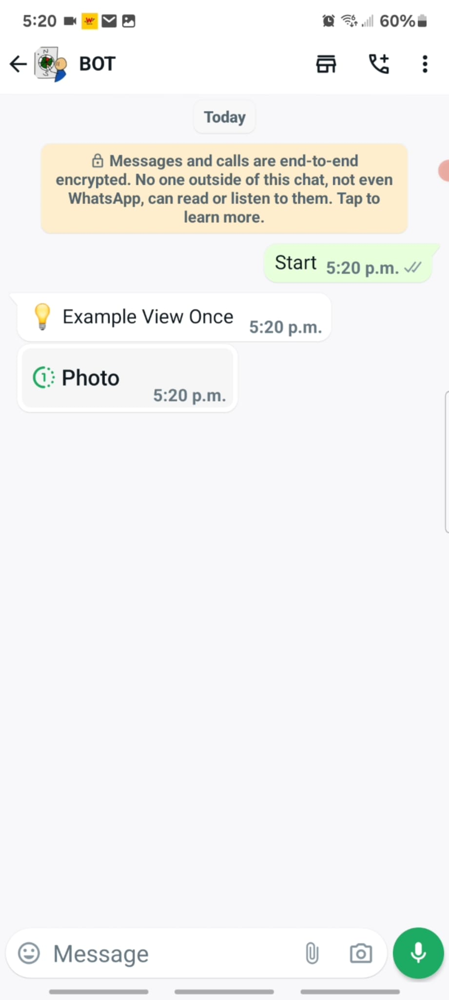
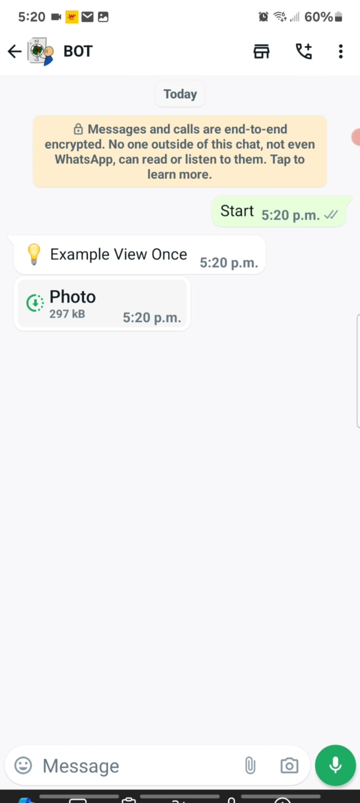
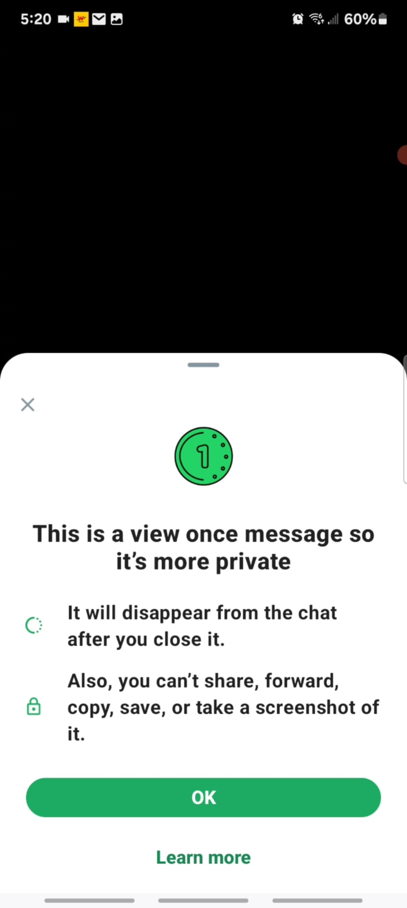
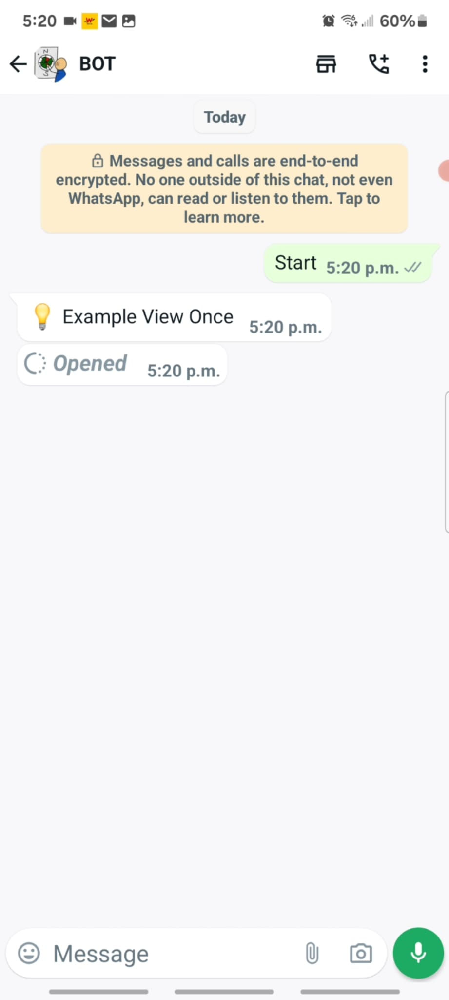

  <a href="https://builderbot.vercel.app/">
    <picture>
      
    </picture>
    <h2 align="center">BuilderBot</h2>
  </a>

  
  

## Example: viewOnce

  
Sending image

    <picture>
      
    </picture>
  
Image received

    <picture>
      
    </picture>
  
Image opened and click on View Once icon

    <picture>
      
    </picture>
  
Image opened

    <picture>
      
    </picture>

## Documentation

Visit [builderbot](https://builderbot.vercel.app/) to view the full documentation.
